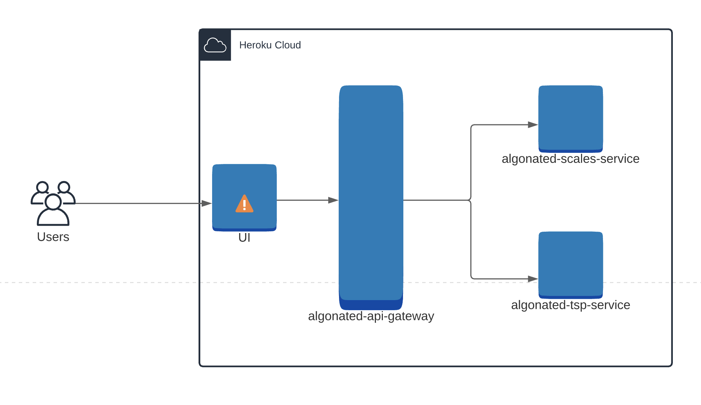

# algonated-ui


The algonated-iu is part of a larger project Algonated. This project is the user interface of the Algonated project and
the animations for the Scales and Travelling Salesman Problem.

Algonated is short for Algorithms Animated. This was my final year project in the Brunel University Computer Science
Degree. Algonated is meant to be a platform that can be used by anyone to write algorithms in Java to solve well-known
heuristic search problems like
[The Scales Problem](https://www.mathmammoth.com/preview/balance_problems.pdf)
and [The Travelling Salesman Problem](https://en.wikipedia.org/wiki/Travelling_salesman_problem). This project has space
for expansion and more exercises will be added in due to time.

## High-level diagram



## Installation

If you want to run locally.

```shell
yarn start
```

## Exercises

At the moment there are only two exercises
available, [the Scales Problem](https://algonated.herokuapp.com/exercises/scales)
and [the Travelling Salesman Problem](https://algonated.herokuapp.com/exercises/tsp).

Each exercise is usually comprised of:

* **Exercise Description** - the aim of the problem and additional instructions
* **Code Editor and Summary** - An IDE that can be used to write code and a statistical summary of the performance of
  the code
* **Animation** - This is a custom animation that represents the behaviour of the algorithm

### Scales Problem

#### Animation

The scales problem contains two animations that can found under `src/components/exercise/scales/ScaleAnimations.js`.

##### Bar animation

This was the original animation.


#### Balance animation

This is the new and default animation.


### TSP animation

There is only one tsp animation. The circles are supposed to resemble nodes and the strokes edges.


## Contributing

Pull requests are welcome. For major changes, please open an issue first to discuss what you would like to change.

Please make sure to update tests as appropriate.

## License

```text
MIT License

Copyright (c) 2021 Dercio Daio

Permission is hereby granted, free of charge, to any person obtaining a copy
of this software and associated documentation files (the "Software"), to deal
in the Software without restriction, including without limitation the rights
to use, copy, modify, merge, publish, distribute, sublicense, and/or sell
copies of the Software, and to permit persons to whom the Software is
furnished to do so, subject to the following conditions:

The above copyright notice and this permission notice shall be included in all
copies or substantial portions of the Software.

THE SOFTWARE IS PROVIDED "AS IS", WITHOUT WARRANTY OF ANY KIND, EXPRESS OR
IMPLIED, INCLUDING BUT NOT LIMITED TO THE WARRANTIES OF MERCHANTABILITY,
FITNESS FOR A PARTICULAR PURPOSE AND NONINFRINGEMENT. IN NO EVENT SHALL THE
AUTHORS OR COPYRIGHT HOLDERS BE LIABLE FOR ANY CLAIM, DAMAGES OR OTHER
LIABILITY, WHETHER IN AN ACTION OF CONTRACT, TORT OR OTHERWISE, ARISING FROM,
OUT OF OR IN CONNECTION WITH THE SOFTWARE OR THE USE OR OTHER DEALINGS IN THE
SOFTWARE.
```
